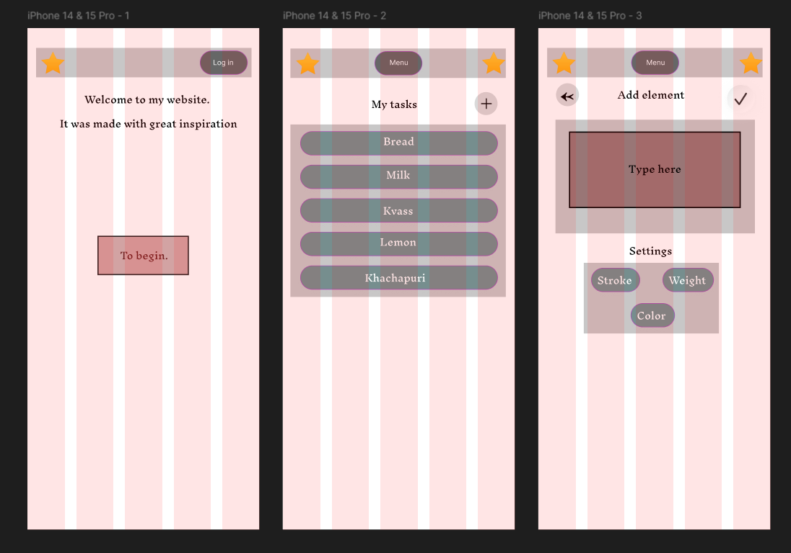

# q
📋 Цель работы
Ознакомление с принципами проектирования интерфейсов и создание интерактивного прототипа мобильного приложения в Figma для его последующей реализации на Flutter.

🎯 Выполненные задачи
Подготовка среды: создание аккаунта и проекта в Figma

Создание макетов: разработка 3 ключевых экранов приложения

Прототипирование: настройка интерактивных переходов между экранами

Тестирование: проверка логики работы прототипа в режиме презентации

🖼️ Созданные экраны
Было создано три основных экрана:

Экран приветствия (Splash Screen)

Логотип приложения

Кнопка «Начать»

Главный экран (Main Screen)

Верхняя панель с названием приложения

Список карточек-напоминаний

Плавающая кнопка «+» для добавления нового элемента

Экран добавления (Add Item Screen)

Поле для ввода текста

Кнопка «Сохранить»

Кнопка «Назад» в виде стрелки в верхней панели

🔗 Навигация и логика работы
Навигация между экранами была реализована следующим образом:

С экрана приветствия: Нажатие на кнопку «Начать» ведет на Главный экран

С главного экрана: Нажатие на кнопку «+» ведет на Экран добавления

С экрана добавления:

Кнопка «Сохранить» возвращает на Главный экран

Кнопка «Назад» возвращает на Главный экран

Для переходов использовалась анимация Slide In, имитирующая стандартное поведение нативных мобильных приложений.

📸 Контрольные точки

https://www.figma.com/design/G3pexZybqU2vibHxWOlH42/Prototype_App_Sharipov?node-id=0-1&t=1Q1JugVWoCrG3Ouj-1
1. Режим Design: общий вид всех экранов 

2. Режим Prototype: соединения между экранами

3. Режим Present: работающий прототип

Работу выполнил: Шарипов Данис Эдуардович
Группа: ЭФБО-09-23
